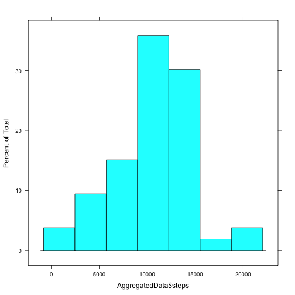
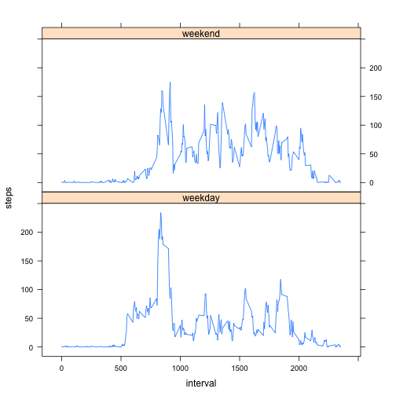

# Reproducible Research: Peer Assessment 1
Coursera project of student Frobenius7     


## Loading and preprocessing the data


```r
setwd("/Users/vb/coursera_r/05-Reproductible Research/RepData_PeerAssessment1")
ActData=read.csv("activity.csv")
library(lattice)
```

## What is mean total number of steps taken per day?

1.Make a histogram of the total number of steps taken each day


```r
#aggregate values by date
AggregatedData<-aggregate(steps~date, data=ActData, FUN=sum)
#plot histogram
histogram(AggregatedData$steps,density=10)
```

 

2.Calculate and report the mean and median total number of steps taken per day


```r
meanval<-mean(AggregatedData$steps)
medval<-median(AggregatedData$steps)
```

Mean value is 1.0766 &times; 10<sup>4</sup> and Median value is 10765

## What is the average daily activity pattern?

1.Make a time series plot (i.e. type = "l") of the 5-minute interval (x-axis) 
and the average number of steps taken, averaged across all days (y-axis)


```r
#aggregate values by interval
AggregatedInterval<-aggregate(steps~interval, data=ActData, FUN=mean)
xyplot(steps~interval,AggregatedInterval, type="l")
```

 

2.Which 5-minute interval, on average across all the days in the dataset, contains the maximum number of steps?


```r
AggregatedInterval$interval[which.max(AggregatedInterval$steps)]
```

```
## [1] 835
```

## Imputing missing values

Note that there are a number of days/intervals where there are missing values (coded as NA). The presence of missing days may introduce bias into some calculations or summaries of the data.

1.Calculate and report the total number of missing values in the dataset (i.e. the total number of rows with NAs)


```r
sum(is.na(ActData))
```

```
## [1] 2304
```

2.Devise a strategy for filling in all of the missing values in the dataset. The strategy does not need to be sophisticated. For example, you could use the mean/median for that day, or the mean for that 5-minute interval, etc.

**I've decided to choose mean for that 5-minute interval** 

3.Create a new dataset that is equal to the original dataset but with the missing data filled in.


```r
ImpData<-ActData
NaVector<-is.na(ActData$steps)
ImpData <- merge(ImpData, AggregatedInterval, by = "interval", suffixes = c("", "Aggr"))
ImpData$steps[NaVector]<-ImpData$stepsAggr[NaVector]
```

4.Make a histogram of the total number of steps taken each day and Calculate and report the mean and median total number of steps taken per day. Do these values differ from the estimates from the first part of the assignment? What is the impact of imputing missing data on the estimates of the total daily number of steps?


```r
#aggregate values by date
AggregatedDataI<-aggregate(steps~date, data=ImpData, FUN=sum)
#plot histogram
histogram(AggregatedData$steps,density=10)
```

 

```r
meanvalI<-mean(AggregatedDataI$steps)
medvalI<-median(AggregatedDataI$steps)
```

Imputed Mean value is 9563.9304 and Median value is 1.1216 &times; 10<sup>4</sup> Those values are different from the original data 

## Are there differences in activity patterns between weekdays and weekends?

For this part the weekdays() function may be of some help here. Use the dataset with the filled-in missing values for this part.

1.Create a new factor variable in the dataset with two levels – “weekday” and “weekend” indicating whether a given date is a weekday or weekend day.


```r
typeoftheday <- function(date) {
    if (weekdays(as.Date(date)) %in% c("Saturday", "Sunday")) {
        "weekend"
    } else {
        "weekday"
    }
}
ImpData$daytype <- as.factor(sapply(ImpData$date, typeoftheday))
```

2.Make a panel plot containing a time series plot (i.e. type = "l") of the 5-minute interval (x-axis) and the average number of steps taken, averaged across all weekday days or weekend days (y-axis).

```r
AggregatedIntervalImp<-aggregate(steps~interval+daytype, data=ImpData, FUN=mean)
xyplot(steps~interval|daytype,AggregatedIntervalImp, type="l", layout=c(1,2))
```

 
